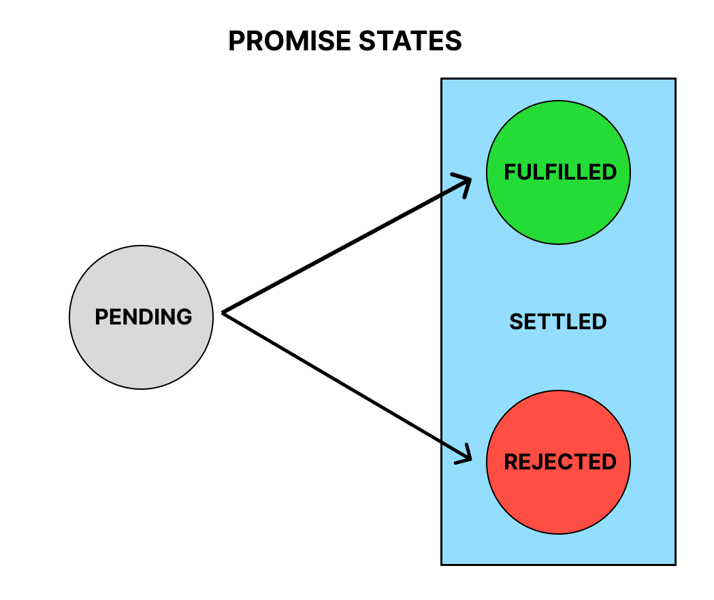

# Promises

## "Producing code" is code that can take some time.

## "Consuming code" is code that must wait for the result.

## A Promise is a JavaScript object that links producing code and consuming code.
---

Often, as web developers, we write code that takes some time to execute and we don't want our applications to grind to a halt while they do their job. We fetch data from external API's or perform CRUD operations in a database.

Prior to ES6, callbacks were the best solution we had when solving these problems, but there were a lot of challenges with that approach. You may have heard of "callback hell,"  code in which callbacks that were dependent on other callbacks were nested deeper and deeper into each other.

In ES6, Promises became a part of JavaScript. They are a much cleaner and more elegant way to deal with asynchronous operations. A Promise is just what it sounds like—a promise to deliver a result.

Although we won't be creating Promises much in this stack,we will be using the Fetch API, the Axios library both of which return Promises. Most of the Mongoose library we use will return objects that are like Promises. We should know the basic anatomy of a Promise, and how to create a simple Promise.

A promise is a JavaScript object instantiated with the `new Promise()` constructor. A function is passed to the constructor called the *executor*, and it contains what's called *producing code*—typically some asynchronous operation.

## Producer

```js
const myPromise = new Promise((resolve, reject) => {
    // executor (producing code
    // that takes some time to complete)
    // eventually produces some result
});
```

When the executor obtains the result, it will call one of these callbacks:

- `resolve(value)` — if the job is finished successfully, with the resulting value.
- `reject(error)` — if an error has occurred, error is the error object.

When the executor is finished with the attempt, it calls `resolve` if it was successful or `reject` if there was an error.

The promise object returned by the `new Promise()` constructor has two properties:

- state — initially "pending", then changes to either "fulfilled" when `resolve` is called or "rejected" when `reject` is called.
- result — initially undefined, then changes to value when `resolve(value)` is called or error when `reject(error)` is called.

So the executor eventually moves the Promise to one of these states:



## Consumer

Once we have created a Promise object, we have to learn how to handle a resolution or rejection. A consumer function should get notified once a producer's task is settled.

We have three handler methods for use in a consumer function:

- `.then()` - handles the resulting value when the Promise's state is fulfilled.
- `.catch()` - handles the resulting error when the Promise's state is rejected.
- `finally()` - handles any cleanup, like stopping a loader. If used, it runs irrespective of resolution or rejection.

A Promise object serves as a link between the executor (the "producing code") and the consuming functions which will receive the result or error. Consuming functions can receive a value or an error by using the methods `.then` and `.catch`.

```js
myPromise
    .then((result) => {
        console.log('Success: Promise resolved.');
        console.log(result);
    })
    .catch((error) => {
        console.log('Error: Promise rejected.');
        console.log(error);
    })
    .finally(() => {
        console.log('Promise settled.')
    });
```

Now that we understand the basics of Promises, let's see an example.

```js
const coinTossForHeads = new Promise((resolve, reject) => {
  let coinToss;
  setTimeout(() => {
    const randNum = Math.random();
    if (randNum < 0.5) {
      coinToss = 'Heads';
      resolve(`Success! ${coinToss} was tossed.`);
    } else {
      coinToss = 'Tails';
      reject(`Error! ${coinToss} was tossed.`);
    }
  }, 2000);
});

coinTossForHeads
  .then((result) => console.log(result))
  .catch((error) => console.log(error))
  .finally(() => console.log(`Promise settled.`));
```

What did we do?
  1. We created a Promise called `coinTossForHeads` using the `new Promise()` constructor.
  2. Inside the callback, we created a variable called `coinToss`.
  3. Then we called the `setTimeout()` function to simulate code that takes some time to execute, we have a callback function as the first argument, and a time of 2000 milliseconds as the second argument.
  4. Inside the callback, we call `Math.random()` and assign its return value to a variable called `randNum`.
  5. If it's less than 0.5, the `coinToss` is heads, and we call `resolve` with a success message.
  6. If it's greater than or equal to 0.5, the `coinToss` is tails, and we call `reject` with an error message.
  7. Finally, we consume the Promise object by invoking the `coinTossForHeads` function and calling `.then()` to get the success message if we get heads, `.catch()` to get the error message if we get tails, and `.finally()` to show the promise has settled.
