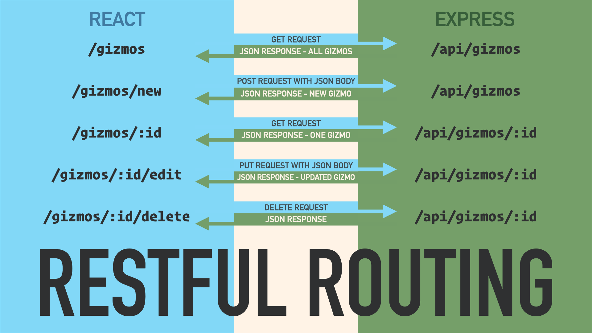

# What is an API?

We have learned how to consume web APIs in our React applications on the front-end. We make `axios.get()` requests to the appropriate endpoint. Now it's time for the other end of this handshake. Today we'll build Express servers that handle those requests on the back-end. We'll learn how to construct the response to the request—the endpoints themselves.

Our React applications will make `axios.get()` requests, `axios.post()` requests,`axios.put()` requests, and `axios.delete()` requests to our Express server. It is up to us to formulate the appropriate JSON responses at each endpoint.

No other stack will teach us more about the nuts and bolts of the request-response cycle.

With that in mind, we should always strive to practice RESTful routing, both in our front-facing routes and our back-end APIs.

